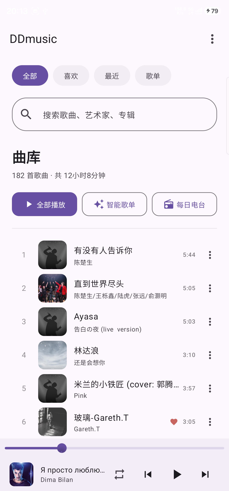
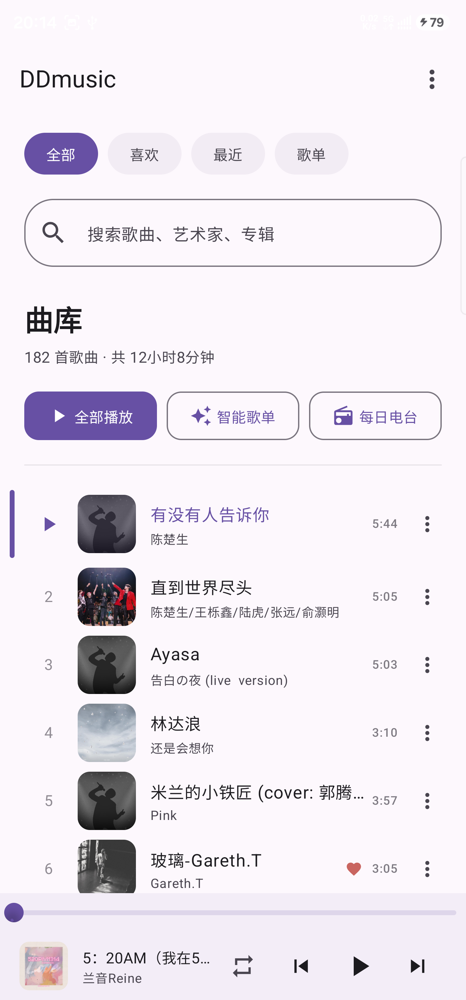
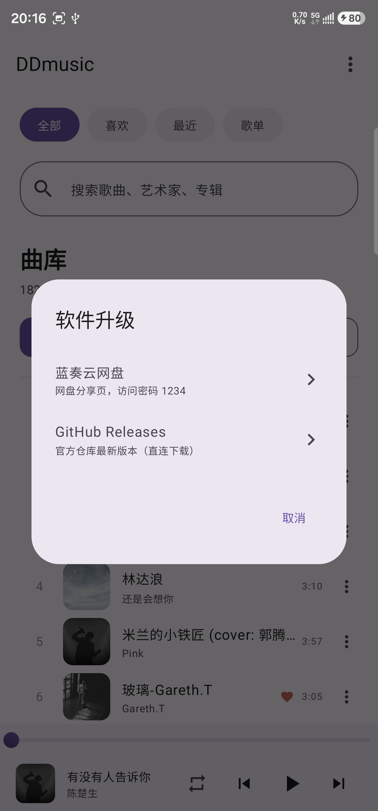

# DDmusic 🎵

一款为中文用户打造的安卓音乐播放器 —— 本地音乐 + 在线试听/下载 + 听歌识曲，界面简洁、纯粹无广告。

**当前版本：V1.1.0** | Android 8.0+ | 免费开源

---

## ✨ 功能亮点

- **本地曲库**：自动扫描手机内全部音乐，按歌曲/艺术家/专辑/文件夹浏览
- **沉浸播放器**：模糊背景 + 旋转封面 + 逐行歌词，支持锁屏/通知栏控制
- **在线音源**：三源聚合搜索，试听、下载一步到位，自动匹配封面与歌词
- **听歌识曲**：听到好歌不知道名字？录一段 10 秒音频即可识别并跳转搜索
- **每日电台**：每天为你换一批大半全新的推荐歌曲，常听常新
- **智能歌单**：最近播放、收藏、随机电台，分类清晰
- **均衡器**：内置多段 EQ，调出自己喜欢的音色
- **双通道升级**：应用内即可检查并下载新版本（GitHub / 蓝奏云）

## 📱 应用截图

| 音乐库 | 播放器 | 软件升级 |
|:---:|:---:|:---:|
|  |  |  |

## 📥 下载安装

两个下载通道，任选其一（内容一致，均为最新版）：

**通道一：蓝奏云**（国内直连，速度快）

> 下载地址：https://wwbpy.lanzouq.com/b01eurncrg
> 访问密码：`1234`

**通道二：GitHub Releases**（国际网络更稳定）

> 下载地址：https://github.com/drw1230/music-app/releases/latest

安装步骤：下载 APK → 点击安装 → 若提示"未知来源应用"，允许即可。

## 🚀 快速上手

1. 打开 DDmusic，等待自动扫描本地音乐
2. 点击底部迷你播放条进入全屏播放器，左右滑动切歌
3. 主页 ⋮ 菜单 → 软件升级，可检查新版本
4. 主页 ⋮ 菜单 → 关于 DDmusic，查看版本信息与联系方式

## 🛠 技术栈

| 组件 | 说明 |
|------|------|
| Kotlin 2.0 + Jetpack Compose | 声明式 UI |
| Media3 / ExoPlayer | 播放引擎 |
| DataStore / Room | 本地持久化 |
| GitHub Actions | 云端自动构建发版 |

## 📮 联系作者

邮箱：**244029088@qq.com**（点击可复制）

欢迎反馈 Bug、提出功能建议！

---

*DDmusic 由个人开发者维护，完全免费，无广告、无追踪。如果觉得好用，欢迎分享给朋友～*
